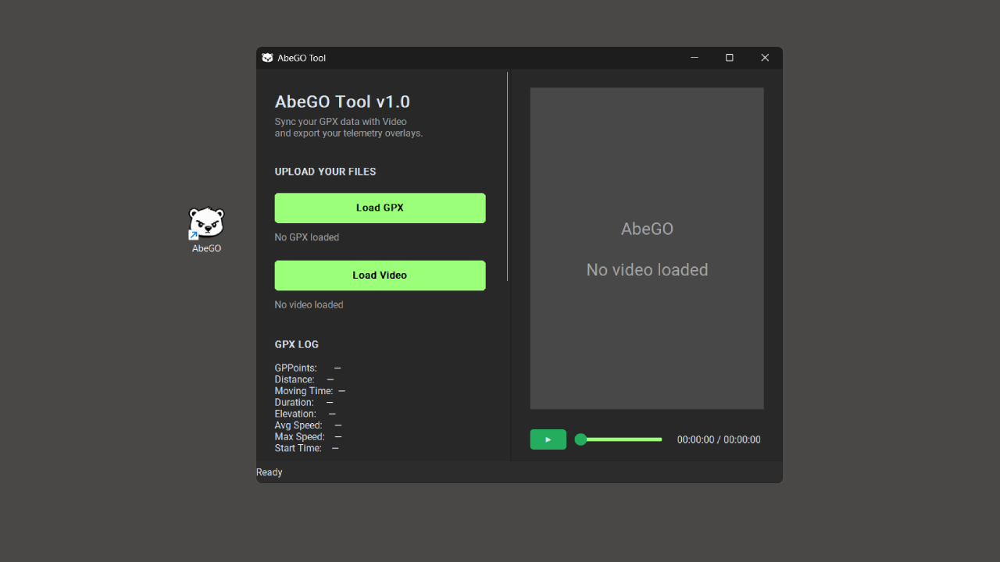
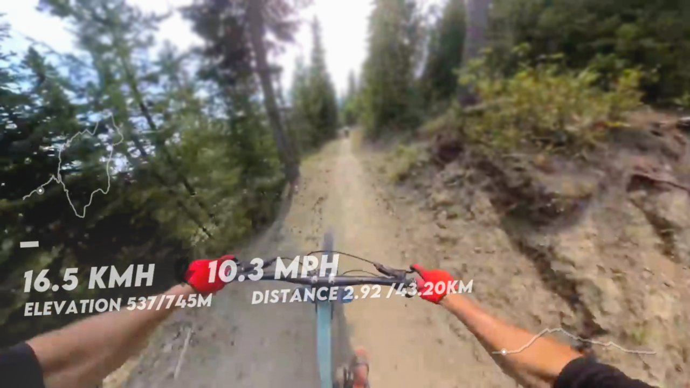
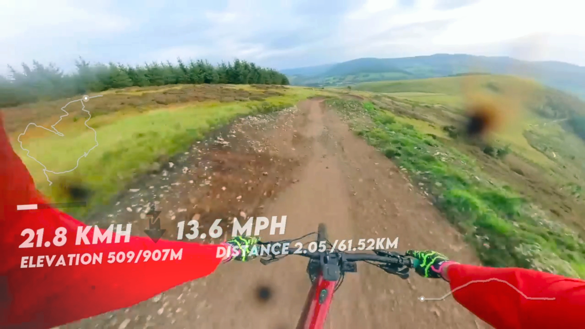

# AbeGO Video & GPX Telemetry Sync Tool
Sync Data. Overlay Metrics. Export Video.

 

        <a href="#about">1. About</a> 
        <a href="#options">2. How it works</a> 
        <a href="#preview"> 3. Preview</a> 
        <a href="#conclusion">4. Conclusion</a> 
    

    

     
     <section id="about">
        <h2>1. About</h2>
        

        AbeGO is a WIN desktop tool designed to turn your ride videos or other outdoor activities into professional looking telemetry clips.   
        Simply import a GPX file from Strava, Garmin, or any other GPS device, add your action camera video, and effortlessly sync the GPS data with your footage.   
        Once synced, you can export partial highlights or full length videos with your real time activity metrics displayed directly on the screen.
           <h1>🐻 Install options: </h1> 
         <pre><code>git clone "https://github.com/abeamar/AbeGO.git"</code></pre> 
         Download the latest AbeGO.exe binary.
         The application is completely self-contained, no installation or Python setup required.
        
    </section>
            

    <section id="options">
        <h2>2. How it works</h2>
        
AbeGO streamlines the complex telemetry video process by combining several distinct steps into one seamless workflow:   
        – GPX Parsing and Extract precise data strings automatically.   
        – Telemetry Processing, Smooth and compute accurate metrics.   
        – Video Processing quality rendering without compromising source footage resolution.   
        – Smart Syncing, match your GPX log timelines perfectly with your video files.   
        – Data Visualization and Map Rendering.   
        – Flexible and fast Export, render specific partial highlights or full length video.   
        – Real Time Video Previews      
        Before kicking off an export, you can preview exactly how the telemetry graphics look on your video frame:   
        – View the entire GPX log alongside comprehensive statistics.   
        – Monitor current and total speed dynamic indicators.   
        – Track current and total elevation metrics.   
        – Display current and total distance counters.   
        – Render interactive route maps and progress graphics on screen.         
    </section>
            

    <section id="preview">
        <h2>Preview</h2>
      

      
      
              
      

    </section>
            

    <section id="conclusion">
        <h2>3. Conclusion</h2>
        
Overall, the purpose of this app is to link the gap between raw data tracking and engaging visual storytelling.     
            It takes the complexity out of video production so you can focus on your next adventure.    
 </section>
         

